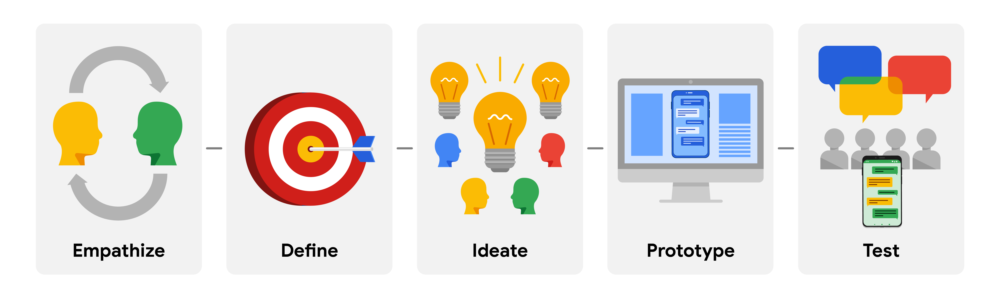

# Foundations of User Experience

The first course of google ux design certificate, one of seven courses series , contain 4 modules.

## Modules Overview

### Module 1

About user experience careers, difference between specialist, generalist and T-shaped designers. interaction, visual and motion specalist ux researcher, ux writer, ux engineer, ux desinger.

### Module 2

About universal design vs inclusive desing vs equity focused design, and user centered design.

### Module 3

About desing thinking, a ux desing framework: empathize - define user needs -ideate solution - prototype - test.  
Desing sprinits and the 5 phases of the desing sprints

### Module 4

About ux research

## Module 2 Think like a ux desginer  

### Product Development Life Cycle

### Characteristics of good user experience

An app has to be:

- equitable
- enjoyable
- useful
- usable

### Universal design vs inclusive design vs equity-focused design

- Universal design: One product for every one. (One size fits all)
- inclusive design: Solve for one, extend for many.
- Equity-focused design: Design for the group that ignored when building products.

- User-centered design: focuses on the user of the product. (puts the user front and center)

## Module 3 - UX design framework

### **Business requirements**

Business goals typically describe

- The users they want the design to target.
- The outcomes they want the design to achieve
- Their vision for the design’s final look and functionality

Business parameters typically describe

- The project’s budget, timeline, and scope

- The specific tools and systems that designers must use or design for

- The requirements and standards the design must meet

### **Design thinking**

- **Empathize**

  - learn more about the user, needs, wants, problems.
  - ignore your assumptions and guesses and focus on your reserch

- **Define**

  - from your research, determine which user problems are the most important ones to solve, and why.
  - provide a clear problem statement.

- **Ideate**

  - come up with as many design solutions as possible.
  - brainstrom for solution with others
  - return to user research to narrow your ideas and provide a clear solution.

- **Prototype and test**
  - produce an early model of a product.
  - Prototyping and testing are interconnected, which means that you’ll test your designs at each stage of prototype development rather than waiting to test until after the working prototype is complete.

### Design sprints

Duration: 5 days  
Phases: understand - Ideate - Decide - Prototype - Test  
Plan One: user research, call expert, find the space  

### **Design Sprint brief**

- Sprint Challenge: ...  
- Key Deliverable: ... goal of sprinit  
- Logistics: ... where when and who .. leader
- Rescources: ...  

Restrospectives: what went well and what our mistakes?  

## Module 4 UX Resaerch

Focuses on Understanding user behaviors, needs, and motivations through observation and feedback.
Empathize with users and identify their expectations and challenges.  
UX research activities can continue throughout the entire design process.  

### Research types

- Foundation Resarch, What are users problems? What we build?
  - Foundational research is always done before you start designing. Within the product development life cycle, foundational research happens during the brainstorm stage (stage one).

- Design Research, How should we build?
  - Design research is done while you design. Within the product development lifecycle, design research happens during the design stage (stage three) to help inform your designs, to fit the needs of users, and to reduce risk. Each time you create a new version of your design, new research should be done to evaluate what works well and what needs to be changed.
  - usability study: testing the product on users.

- Post-Launch Resarch, Did we successed?  
  - In post-launch research, your goal is to answer the question: Did we succeed? This research will tell you how your final product is performing based on established metrics, such as adoption, usage, user satisfaction, and more.

### Research Methods

***Primary Research and Secondary Research***

- Primary:  is research you conduct yourself. Information from direct interactions with users, like interviews, surveys, or usability studies, are considered primary research.  

- Secondary:  is research that uses information someone else has put together. For example, using information from sources like books, articles, or journals is considered secondary research.

***Quantitive esearch and Qualtitive Research***

- Quantitive: Focuse on data gathered by counting or measurement. often collected from large-scale surveys. This type of research aims to answer questions like “how many?” and “how much?”  

- Qualtitive: is primarily collected through observations and conversations. Qualitative research is based on understanding users’ needs and aims to answer questions like “why” or “how did this happen?”  

Interviews & Surveys & Usability Study  

Interviews:

- Open minded  
- plan your interview  
- Be careful of your own body language and reactions
- limit guidance you give users
- choose your words
- Do not go along with user opinions.
- Be aware of bias - false judgment

  - Recency bias
  - Primary bias
  - Sunk cost fallacy
  - Implicit bias
